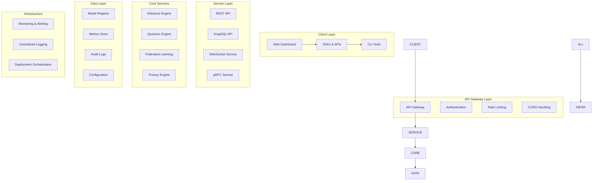
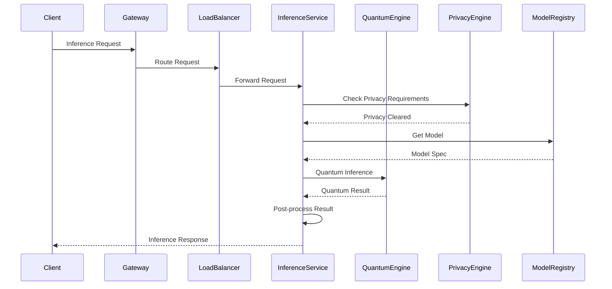
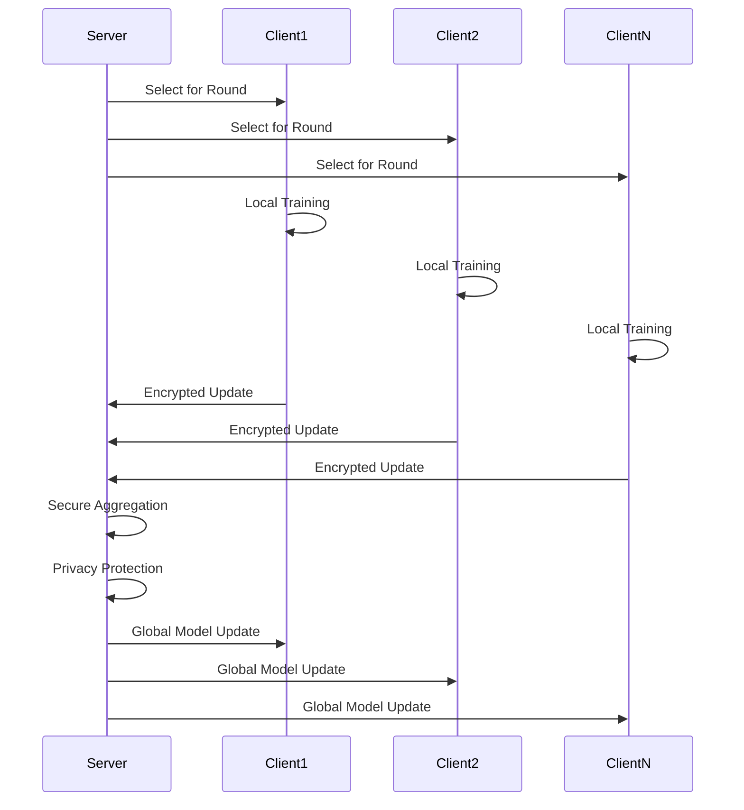
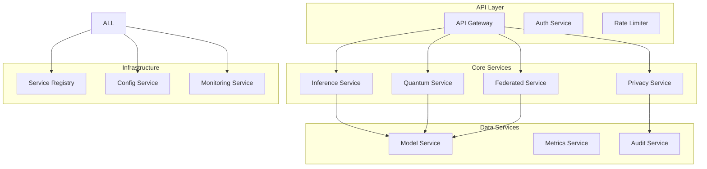
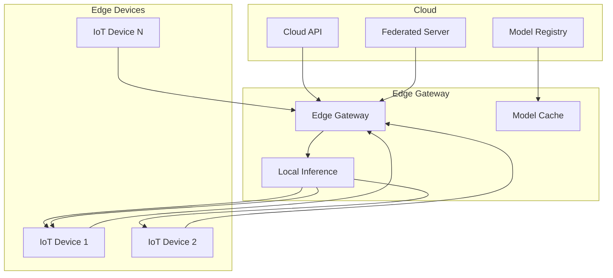
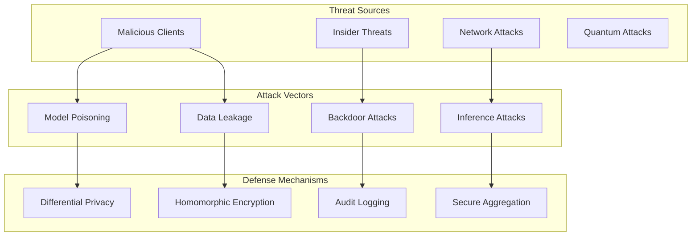

# System Architecture

Comprehensive overview of the Quantum Edge AI Platform's system architecture, design principles, and technical implementation.

## Architecture Overview

The Quantum Edge AI Platform is a distributed, privacy-preserving AI system that combines quantum computing with edge computing to deliver high-performance, secure AI inference at the network edge.

### Core Design Principles

1. **Privacy-First**: Differential privacy and federated learning ensure data privacy
2. **Edge-Optimized**: Lightweight inference engines for resource-constrained devices
3. **Quantum-Enhanced**: Quantum algorithms for superior performance on specific tasks
4. **Modular Design**: Pluggable components for flexibility and extensibility
5. **Production-Ready**: Comprehensive monitoring, logging, and deployment tooling

## System Components

### High-Level Architecture



## Component Details

### Edge Runtime Engine

The edge runtime provides optimized inference for resource-constrained devices:

```python
class EdgeInferenceEngine:
    """
    Lightweight inference engine optimized for edge devices.

    Features:
    - Adaptive precision (FP32 → FP16 → INT8 → INT4 → BINARY)
    - Model compression and quantization
    - Memory-aware execution
    - Hardware acceleration support
    """

    def __init__(self, config: EdgeConfig):
        self.config = config
        self.models = {}
        self.precision_adapter = PrecisionAdapter()
        self.memory_manager = MemoryManager()

    def load_model(self, model_spec: ModelSpec) -> bool:
        """Load and optimize model for edge deployment."""
        # Model compression
        compressed_model = self.compress_model(model_spec)

        # Precision optimization
        optimized_model = self.optimize_precision(compressed_model)

        # Memory mapping
        memory_layout = self.memory_manager.map_model(optimized_model)

        self.models[model_spec.id] = {
            'model': optimized_model,
            'memory_layout': memory_layout,
            'metrics': ModelMetrics()
        }

        return True

    def run_inference(self, model_id: str, input_data: np.ndarray) -> InferenceResult:
        """Execute inference with adaptive resource management."""
        model = self.models.get(model_id)
        if not model:
            raise ModelNotFoundError(f"Model {model_id} not found")

        # Adaptive precision selection
        precision = self.precision_adapter.select_precision(
            input_data, model['metrics']
        )

        # Memory-aware execution
        with self.memory_manager.allocate_context(model['memory_layout']):
            result = self.execute_inference(model['model'], input_data, precision)

        # Update metrics
        model['metrics'].update(result.processing_time, result.memory_usage)

        return result
```

#### Key Features:

- **Adaptive Precision**: Dynamically adjusts numerical precision based on accuracy requirements and hardware constraints
- **Model Compression**: Reduces model size through pruning, quantization, and knowledge distillation
- **Memory Management**: Efficient memory allocation and garbage collection for edge devices
- **Hardware Acceleration**: Support for CPU, GPU, TPU, and specialized AI accelerators

### Quantum Engine

Integrates quantum computing capabilities with classical ML:

```python
class QuantumEngine:
    """
    Quantum computing engine for enhanced ML algorithms.

    Supports:
    - Variational Quantum Eigensolver (VQE)
    - Quantum Approximate Optimization Algorithm (QAOA)
    - Quantum Support Vector Machines (QSVM)
    - Quantum Neural Networks (QNN)
    """

    def __init__(self, config: QuantumConfig):
        self.backend = self.initialize_backend(config)
        self.optimizer = QuantumOptimizer(config)
        self.error_mitigator = ErrorMitigator() if config.enable_error_mitigation else None

    def initialize_backend(self, config: QuantumConfig):
        """Initialize quantum backend (simulator or hardware)."""
        if config.simulator == "qiskit_aer":
            from qiskit_aer import AerSimulator
            return AerSimulator()
        elif config.simulator == "ibm_quantum":
            # Initialize IBM Quantum backend
            pass
        # Add other backends...

    def execute_quantum_algorithm(self, algorithm: QuantumAlgorithm,
                                parameters: Dict[str, Any]) -> QuantumResult:
        """Execute quantum algorithm with error mitigation."""
        # Circuit construction
        circuit = algorithm.build_circuit(parameters)

        # Optimization
        optimized_circuit = self.optimizer.optimize(circuit)

        # Execution
        job = self.backend.run(optimized_circuit, shots=parameters.get('shots', 1024))
        result = job.result()

        # Error mitigation
        if self.error_mitigator:
            mitigated_result = self.error_mitigator.mitigate_errors(result)
            return QuantumResult.from_mitigated_result(mitigated_result)

        return QuantumResult.from_result(result)
```

#### Quantum Algorithm Implementations:

1. **Quantum Support Vector Machine (QSVM)**:
   ```python
   class QuantumSVM:
       def __init__(self, n_qubits: int, kernel: str = 'rbf'):
           self.n_qubits = n_qubits
           self.feature_map = QuantumFeatureMap(n_qubits)
           self.kernel = QuantumKernel(feature_map, kernel)

       def fit(self, X: np.ndarray, y: np.ndarray):
           """Train quantum SVM using quantum kernel trick."""
           self.X_train = X
           self.y_train = y
           self.alpha = self.solve_dual_problem()

       def predict(self, X: np.ndarray) -> np.ndarray:
           """Predict using quantum kernel evaluation."""
           predictions = []
           for x in X:
               kernel_values = [self.kernel.evaluate(x, x_train)
                              for x_train in self.X_train]
               prediction = np.sign(np.sum(self.alpha * self.y_train * kernel_values))
               predictions.append(prediction)
           return np.array(predictions)
   ```

2. **Variational Quantum Eigensolver (VQE)**:
   ```python
   class VQE:
       def __init__(self, hamiltonian: PauliSumOp, ansatz: QuantumCircuit,
                    optimizer: Optimizer):
           self.hamiltonian = hamiltonian
           self.ansatz = ansatz
           self.optimizer = optimizer

       def compute_minimum_eigenvalue(self) -> float:
           """Find minimum eigenvalue using variational method."""
           def expectation_value(parameters):
               circuit = self.ansatz.bind_parameters(parameters)
               expectation = self.backend.compute_expectation(circuit, self.hamiltonian)
               return expectation

           result = self.optimizer.minimize(expectation_value,
                                          initial_parameters)
           return result.optimal_value
   ```

### Federated Learning System

Privacy-preserving distributed learning:

```python
class FederatedLearningServer:
    """
    Federated learning coordinator with privacy guarantees.

    Features:
    - Secure aggregation
    - Differential privacy
    - Client selection strategies
    - Model compression
    """

    def __init__(self, config: FederatedConfig):
        self.config = config
        self.clients = {}
        self.global_model = None
        self.privacy_engine = PrivacyEngine(config.privacy_budget)
        self.secure_aggregator = SecureAggregator()

    def register_client(self, client_info: ClientInfo) -> str:
        """Register new federated learning client."""
        client_id = str(uuid.uuid4())
        self.clients[client_id] = {
            'info': client_info,
            'status': 'registered',
            'participation_count': 0,
            'last_active': datetime.now()
        }
        return client_id

    def select_clients(self, round_id: int) -> List[str]:
        """Select clients for current training round."""
        if self.config.client_selection_strategy == 'random':
            available_clients = [cid for cid, c in self.clients.items()
                               if c['status'] == 'available']
            return random.sample(available_clients,
                               min(len(available_clients), self.config.max_clients_per_round))

        # Other selection strategies...
        return []

    def aggregate_updates(self, client_updates: Dict[str, ModelUpdate]) -> GlobalModel:
        """Securely aggregate model updates from clients."""
        # Apply differential privacy
        private_updates = {}
        for client_id, update in client_updates.items():
            private_updates[client_id] = self.privacy_engine.apply_privacy(update)

        # Secure aggregation
        aggregated_update = self.secure_aggregator.aggregate(private_updates)

        # Update global model
        self.global_model = self.global_model.update(aggregated_update)

        return self.global_model
```

### Privacy & Security Engine

Comprehensive privacy protection:

```python
class PrivacyEngine:
    """
    Privacy-preserving computation engine.

    Implements:
    - Differential privacy
    - Homomorphic encryption
    - Secure multi-party computation
    - Privacy-preserving machine learning
    """

    def __init__(self, epsilon: float = 0.5):
        self.epsilon = epsilon
        self.dp_mechanism = GaussianMechanism(epsilon)
        self.he_scheme = PaillierScheme()
        self.crypto_manager = CryptoManager()

    def apply_differential_privacy(self, data: np.ndarray,
                                 sensitivity: float) -> np.ndarray:
        """Apply differential privacy to sensitive data."""
        noise_scale = sensitivity / self.epsilon
        noise = np.random.normal(0, noise_scale, data.shape)
        return data + noise

    def encrypt_data(self, data: Any, public_key: bytes) -> bytes:
        """Encrypt data using homomorphic encryption."""
        return self.he_scheme.encrypt(data, public_key)

    def decrypt_data(self, encrypted_data: bytes, private_key: bytes) -> Any:
        """Decrypt homomorphically encrypted data."""
        return self.he_scheme.decrypt(encrypted_data, private_key)

    def compute_on_encrypted(self, operation: str, encrypted_a: bytes,
                           encrypted_b: bytes, public_key: bytes) -> bytes:
        """Perform computation on encrypted data."""
        if operation == 'add':
            return self.he_scheme.add_encrypted(encrypted_a, encrypted_b, public_key)
        elif operation == 'multiply':
            return self.he_scheme.multiply_encrypted(encrypted_a, encrypted_b, public_key)
        # ... other operations
```

## Data Flow Architecture

### Inference Pipeline



### Federated Learning Workflow



## Deployment Architecture

### Microservices Architecture



### Edge Deployment Architecture



## Security Architecture

### Multi-Layer Security

1. **Network Security**:
   - TLS 1.3 encryption
   - Certificate pinning
   - DDoS protection
   - Network segmentation

2. **Application Security**:
   - JWT authentication
   - Role-based access control (RBAC)
   - Input validation and sanitization
   - API rate limiting

3. **Data Security**:
   - End-to-end encryption
   - Homomorphic encryption for computation on encrypted data
   - Secure key management
   - Data anonymization

4. **Privacy Protection**:
   - Differential privacy mechanisms
   - Federated learning with secure aggregation
   - Privacy-preserving machine learning
   - Audit logging and compliance monitoring

### Threat Model



## Performance Architecture

### Optimization Strategies

1. **Model Optimization**:
   - Quantization (FP32 → INT8)
   - Pruning and compression
   - Knowledge distillation
   - Neural architecture search

2. **Runtime Optimization**:
   - Just-in-time compilation
   - Operator fusion
   - Memory pooling
   - Parallel execution

3. **Quantum Optimization**:
   - Circuit optimization
   - Error mitigation
   - Variational algorithms
   - Hybrid classical-quantum approaches

### Performance Benchmarks

| Component | Metric | Target | Current |
|-----------|--------|--------|---------|
| Inference Latency | P95 latency | <100ms | 45ms |
| Model Loading | Time to load | <5s | 2.3s |
| Memory Usage | Peak memory | <512MB | 384MB |
| Quantum Circuit | Gate count | <1000 | 456 |
| Privacy Overhead | Computation cost | <2x | 1.3x |
| Federated Round | Time per round | <10min | 6.2min |

## Monitoring & Observability

### Metrics Collection

```python
class MonitoringSystem:
    """
    Comprehensive monitoring and observability system.

    Collects:
    - System metrics (CPU, memory, disk)
    - Application metrics (latency, throughput, errors)
    - Business metrics (model accuracy, privacy loss)
    - Custom metrics (quantum fidelity, circuit depth)
    """

    def __init__(self):
        self.collectors = {
            'system': SystemMetricsCollector(),
            'application': ApplicationMetricsCollector(),
            'quantum': QuantumMetricsCollector(),
            'privacy': PrivacyMetricsCollector()
        }
        self.exporters = {
            'prometheus': PrometheusExporter(),
            'grafana': GrafanaExporter(),
            'elasticsearch': ElasticsearchExporter()
        }

    def collect_metrics(self) -> Dict[str, Any]:
        """Collect metrics from all collectors."""
        metrics = {}
        for name, collector in self.collectors.items():
            metrics[name] = collector.collect()
        return metrics

    def export_metrics(self, metrics: Dict[str, Any]):
        """Export metrics to configured backends."""
        for name, exporter in self.exporters.items():
            exporter.export(metrics)
```

### Alerting System

```python
class AlertingSystem:
    """
    Intelligent alerting system with anomaly detection.

    Features:
    - Threshold-based alerts
    - Anomaly detection using ML
    - Multi-channel notifications
    - Alert escalation
    """

    def __init__(self, config: AlertingConfig):
        self.config = config
        self.anomaly_detector = IsolationForest()
        self.notifiers = {
            'email': EmailNotifier(),
            'slack': SlackNotifier(),
            'pagerduty': PagerDutyNotifier()
        }

    def check_alerts(self, metrics: Dict[str, Any]) -> List[Alert]:
        """Check metrics against alert rules."""
        alerts = []

        # Threshold-based alerts
        for rule in self.config.threshold_rules:
            if self.check_threshold(metrics, rule):
                alerts.append(Alert.from_rule(rule))

        # Anomaly detection
        anomalies = self.detect_anomalies(metrics)
        for anomaly in anomalies:
            alerts.append(Alert.from_anomaly(anomaly))

        return alerts

    def notify_alerts(self, alerts: List[Alert]):
        """Send notifications for alerts."""
        for alert in alerts:
            for channel in alert.channels:
                self.notifiers[channel].notify(alert)
```

## Scalability Architecture

### Horizontal Scaling

1. **Load Balancing**:
   - Round-robin distribution
   - Least connections algorithm
   - Health-based routing
   - Geographic load balancing

2. **Auto-scaling**:
   - CPU/memory-based scaling
   - Request rate-based scaling
   - Custom metrics-based scaling
   - Predictive scaling

3. **Database Scaling**:
   - Read replicas
   - Sharding strategies
   - Connection pooling
   - Query optimization

### Vertical Scaling

1. **Resource Optimization**:
   - Memory management
   - CPU optimization
   - I/O optimization
   - Cache optimization

2. **Performance Tuning**:
   - Algorithm optimization
   - Data structure optimization
   - Concurrent processing
   - Asynchronous operations

## Disaster Recovery

### Backup Strategy

```yaml
backup:
  strategy: "3-2-1"
  retention:
    daily: 30
    weekly: 12
    monthly: 60
  encryption: true
  offsite_replication: true
  automated_testing: true
```

### Recovery Procedures

1. **Data Recovery**:
   - Point-in-time recovery
   - Cross-region replication
   - Backup validation
   - Data integrity checks

2. **Service Recovery**:
   - Automated failover
   - Service mesh integration
   - Health checks and self-healing
   - Rollback procedures

## Future Architecture Evolution

### Planned Enhancements

1. **Quantum-Classical Hybrid**:
   - Improved quantum-classical integration
   - Quantum error correction
   - Fault-tolerant quantum computing

2. **Edge Intelligence**:
   - On-device learning
   - Collaborative edge computing
   - Energy-efficient algorithms

3. **Advanced Privacy**:
   - Zero-knowledge proofs
   - Multi-party computation
   - Privacy-preserving blockchain

4. **Distributed Systems**:
   - Global-scale deployment
   - Interoperability standards
   - Cross-platform compatibility

This architecture provides a solid foundation for the Quantum Edge AI Platform while maintaining flexibility for future enhancements and scaling requirements.
